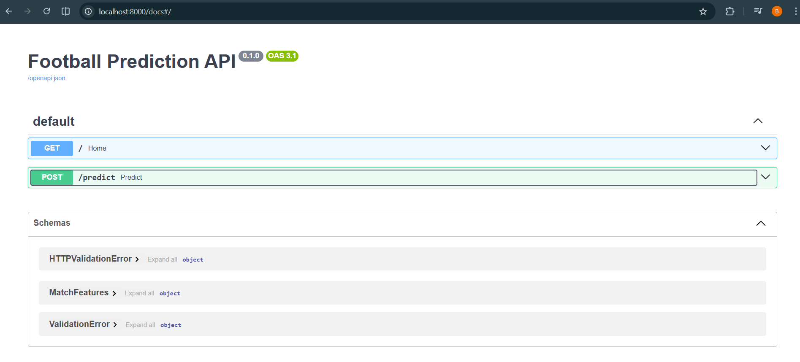
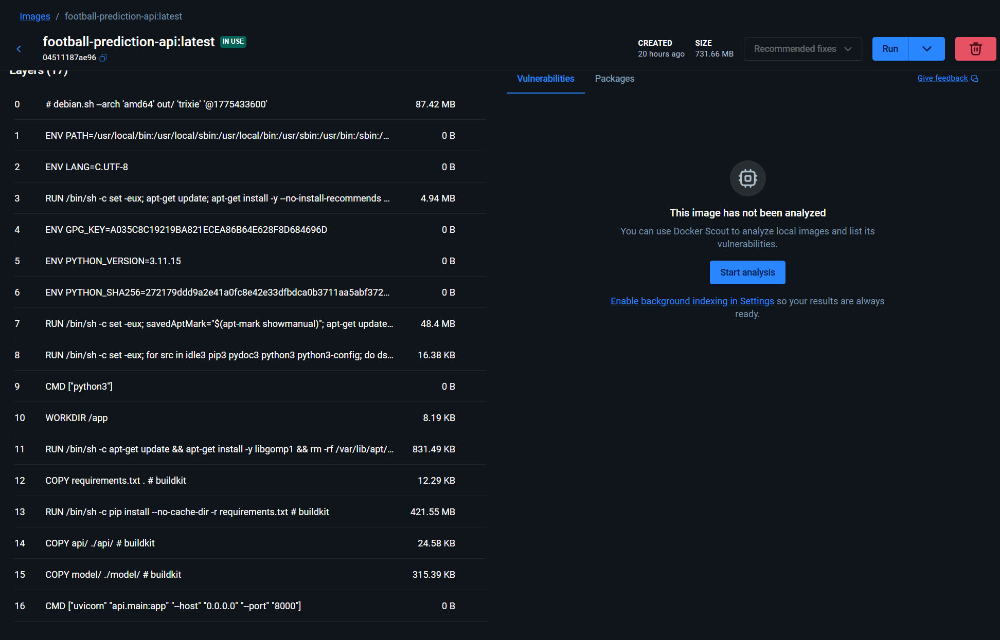
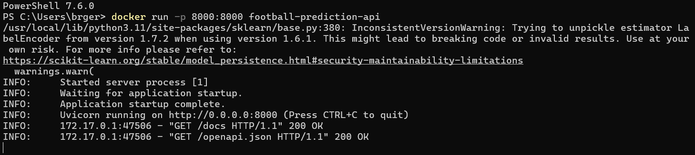

# Predicción de Resultados en La Liga Española

Proyecto end-to-end de Machine Learning para predecir resultados de partidos de La Liga española (Home / Draw / Away), abarcando desde la ingesta de datos hasta el despliegue del modelo con API y Docker.

El enfoque no es superar a las casas de apuestas en accuracy global, sino **entender por qué los empates son estructuralmente difíciles de predecir** y construir un modelo que ofrezca capacidad predictiva donde los modelos convencionales fallan.

## Descripción del Problema

Predecir el resultado de un partido de fútbol es un problema de clasificación multiclase con un desafío conocido en la industria: **los empates son casi impredecibles**. Incluso las casas de apuestas como Bet365, con modelos sofisticados y millones en datos, obtienen 0% de recall en empates — simplemente nunca los predicen.

Este proyecto aborda ese desafío utilizando ~25 temporadas de datos históricos de La Liga (2000-2026), con un enfoque especial en lograr predicciones balanceadas entre las tres clases.

## Arquitectura del Proyecto

```
Football_Prediction/
├── .github/workflows/
│   └── ci.yml                 ← CI/CD con GitHub Actions
├── api/
│   └── main.py                ← API de predicción (FastAPI)
├── data/
│   ├── raw/                   ← 26 CSVs de football-data.co.uk
│   ├── processed/             ← data_modeling.csv (7,717 partidos × 25 features)
│   └── scores/                ← Predicciones exportadas
├── SQL/
│   └── 01_creacion_tablas.sql ← Modelo estrella (dim_equipo, dim_fecha, fact_partido)
├── Script/
│   ├── 01_Scrapping.ipynb     ← Descarga de datos
│   ├── 02_Extract.ipynb       ← ETL: limpieza + carga a SQL Server
│   ├── 03_EDA.ipynb           ← Análisis exploratorio
│   ├── 04_FeatureEngineering.ipynb ← Rolling averages + unpivot
│   └── 05_Modeling.ipynb      ← Entrenamiento, evaluación y Model Understanding
├── model/
│   └── lgbm_balanced.pkl      ← Modelo final exportado
├── src/                       ← Pipeline modularizado (producción)
│   ├── config.py              ← Configuración centralizada
│   ├── make_dataset.py        ← Descarga + limpieza + feature engineering
│   ├── train.py               ← Entrenamiento del modelo
│   ├── evaluate.py            ← Evaluación con métricas
│   └── predict.py             ← Generación de predicciones
├── test/                      ← Tests automatizados (pytest)
│   ├── test_make_dataset.py
│   └── test_model.py
├── Dockerfile                 ← Containerización de la API
├── requirements.txt
└── README.md
```

## Datos

**Fuente:** [football-data.co.uk](https://www.football-data.co.uk/spainm.php) — 26 archivos CSV con estadísticas de partidos de La Liga desde la temporada 2000/01 hasta 2025/26.

**Base de datos:** SQL Server Express con modelo estrella:

- `dim_equipo` — 52 equipos históricos
- `dim_fecha` — fechas con atributos temporales
- `fact_partido` — partidos con estadísticas y cuotas

**Dataset final:** 7,717 partidos con 25 features (temporadas 2005/06 a 2025/26, filtrando las primeras 5 por falta de estadísticas completas).

## Feature Engineering

El enfoque central es capturar el **momentum reciente** de cada equipo, no su identidad:

1. **Unpivot** de `fact_partido` en vista por equipo (local + visitante en una sola tabla cronológica)
2. **Rolling averages** con ventana de 5 partidos y `shift(1)` para evitar data leakage
3. **Re-pivot** al formato partido con sufijos `_local` / `_visitante`

**25 features finales:**

| Tipo                  | Features                                                                                                      | Cantidad |
| --------------------- | ------------------------------------------------------------------------------------------------------------- | -------- |
| Rolling avg local     | Goles, goles rival, tiros, tiros al arco, corners, faltas, amarillas, rojas, goles HT, goles HT rival, puntos | 11       |
| Rolling avg visitante | Las mismas 11 estadísticas                                                                                   | 11       |
| Cuotas Bet365         | B365H, B365D, B365A                                                                                           | 3        |

**Decisiones de diseño:**

- Los rolling averages son **continuos entre temporadas** (no se resetean) para preservar la forma del equipo
- Los nombres de equipo se **excluyen como features** — los equipos que ascienden/descienden no tendrían historial, y el rolling average ya codifica la forma
- Solo se retienen las cuotas de **B365** (las demás casas tienen 40-93% de valores nulos)

## Metodología

**Split temporal estricto** (sin data leakage):

- **Train:** Temporadas 2005/06 a 2023/24
- **Test:** Temporada 2024/25 (380 partidos)
- **Validation:** Temporada 2025/26 (265 partidos, temporada en curso)

**Cross-validation:** TimeSeriesSplit con 5 folds sobre el set de entrenamiento.

**Búsqueda de hiperparámetros:** GridSearchCV para todos los modelos.

## Resultados

### Comparación de Modelos (Test — Temporada 2024/25)

| Modelo                       | Accuracy         | Recall (H)     | Recall (D)     | Recall (A)     |
| ---------------------------- | ---------------- | -------------- | -------------- | -------------- |
| B365 Baseline                | 54.47%           | 0.87           | 0.00           | 0.58           |
| Decision Tree (tuneado)      | 56.05%           | 0.86           | 0.00           | 0.57           |
| Random Forest (tuneado)      | 55.26%           | 0.85           | 0.00           | 0.58           |
| LightGBM                     | 53.95%           | 0.93           | 0.00           | 0.42           |
| XGBoost                      | 53.95%           | 0.86           | 0.00           | 0.53           |
| LightGBM (balanced)          | 52.37%           | 0.57           | 0.39           | 0.57           |
| **XGBoost (balanced)** | **52.63%** | **0.56** | **0.45** | **0.54** |

### Modelo Elegido: LightGBM Balanced

Se prioriza el **equilibrio entre clases** sobre el accuracy global. Ambos modelos balanced (LightGBM y XGBoost) convergen a resultados prácticamente idénticos en validación (50.2-50.6% accuracy, 0.44 recall Draw), lo que refuerza que **el límite está en los datos, no en el algoritmo**. Se elige LightGBM por tener `class_weight='balanced'` integrado (más limpio que `sample_weight` externo).

**Validación (temporada 2025/26):**

- Accuracy: 50.6%
- Draw recall: 0.44 (mejoró vs test)
- Sin overfitting — generalización consistente

## Model Understanding

### SHAP Analysis

- Las **tres odds B365 dominan** la capacidad predictiva del modelo. Las rolling averages aportan información marginal — las casas de apuestas ya incorporan implícitamente la forma reciente en sus cuotas.
- Para predecir **Draw**, solo **B365D** tiene señal fuerte. B365H y B365A son prácticamente irrelevantes para esta clase.
- La dirección es consistente: B365D bajo (empate probable según la casa) → empuja hacia Draw. B365D alto (empate improbable) → empuja lejos del Draw.

### Confusion Matrix

- El 60.8% de empates reales se pierde, repartido casi parejo entre H (27.8%) y A (33.0%) — **sin sesgo direccional**. El modelo simplemente no logra distinguir empates de victorias ajustadas.
- Cuando el modelo falla en H, el error va mayoritariamente a D (30.2%) — partidos donde el local domina pero no convierte.
- La precision de Draw es baja (32%): muchas victorias reales se "contaminan" hacia la predicción de empate.

### Calibración

- **Clase H:** Bien calibrada — las probabilidades predichas reflejan la realidad.
- **Clase D:** El modelo nunca asigna más de ~40% a Draw. Ligeramente sobreconfiado (dice 35%, realidad ~28%).
- **Clase A:** Subconfiado — predice 30-40% pero la realidad es 50-60%.

### Análisis de Confianza

- Cuando la confianza es **alta** (prob. máxima > 39%): accuracy = **66.8%** — 12 puntos sobre B365.
- Cuando la confianza es **baja** (≤ 39%): accuracy = **37.9%** — casi aleatorio.
- En ~50% de los partidos, el modelo no tiene señal suficiente para una predicción confiable.

## Hallazgos Clave

1. **El modelo sabe cuándo no sabe:** Las probabilidades sirven para filtrar predicciones confiables. En los partidos donde el modelo tiene alta confianza, supera a B365 por 12 puntos.
2. **El empate es una limitación estructural del dominio:** Cinco algoritmos diferentes + B365 convergen al mismo resultado sin balanceo: recall Draw = 0. Esto no es un problema del modelo, sino del fútbol.
3. **Las odds B365 subsumen las rolling averages:** El SHAP muestra que la información de forma reciente ya está incorporada en las cuotas de las casas de apuestas.
4. **El accuracy no es la métrica correcta:** Un modelo con 56% que solo predice H y A es menos útil que uno con 50% que distribuye predicciones entre las tres clases.
5. **Promediar porcentajes entre temporadas es un error estadístico:** Las proporciones deben calcularse como proporción ponderada, no como promedio de promedios (relacionado con la Paradoja de Simpson).
6. **Los H2H (head-to-head) no aportan:** Con solo ~2 enfrentamientos por temporada por pareja de equipos, los datos son demasiado escasos. El rolling form general es más robusto.
7. **Limitaciones:** Variables no observadas (lesiones, motivación, decisiones tácticas, clima) contribuyen al ruido inherente. Features dinámicas (posición en tabla, puntos acumulados) y la transformación de odds a probabilidades implícitas son mejoras pendientes.

## Ejecución

### Pipeline de datos y modelado

```bash
pip install -r requirements.txt

python -m src.make_dataset    # Descarga + limpieza + feature engineering
python -m src.train           # Entrenar modelo
python -m src.evaluate        # Evaluar en test y validation
python -m src.predict         # Generar predicciones
```

### API de predicción

```bash
python -m uvicorn api.main:app --reload
```

La documentación interactiva estará en `http://localhost:8000/docs`



### Docker

```bash
docker build -t football-prediction-api .
docker run -p 8000:8000 football-prediction-api
```

La API estará disponible en `http://localhost:8000/docs`





### Tests

```bash
pytest
```

## 🛠️ Stack Tecnológico

- **Python** — pandas, numpy, scikit-learn, LightGBM, XGBoost, SHAP, matplotlib, seaborn
- **SQL Server Express** — modelo estrella para almacenamiento y EDA
- **FastAPI** — API de predicción
- **Docker** — containerización de la API
- **GitHub Actions** — CI/CD (tests automatizados en cada push)
- **pytest** — testing automatizado
- **Jupyter Notebooks** — desarrollo y exploración
- **Git/GitHub** — control de versiones

## 🗺️ Roadmap

- [X] Ingesta de datos (football-data.co.uk)
- [X] ETL y carga a SQL Server (star schema)
- [X] EDA
- [X] Feature Engineering (rolling averages)
- [X] Modelado (DT → RF → LightGBM → XGBoost → balanced)
- [X] Model Understanding (SHAP, calibración, análisis de confianza)
- [X] Exportación del modelo (.pkl)
- [X] Modularización del pipeline (`src/`)
- [X] Tests (pytest)
- [X] API de predicción (FastAPI)
- [X] Containerización (Docker)
- [X] CI/CD (GitHub Actions)

## 👤 Autor

**Brandon Gerald** — [GitHub](https://github.com/geraldb1)
